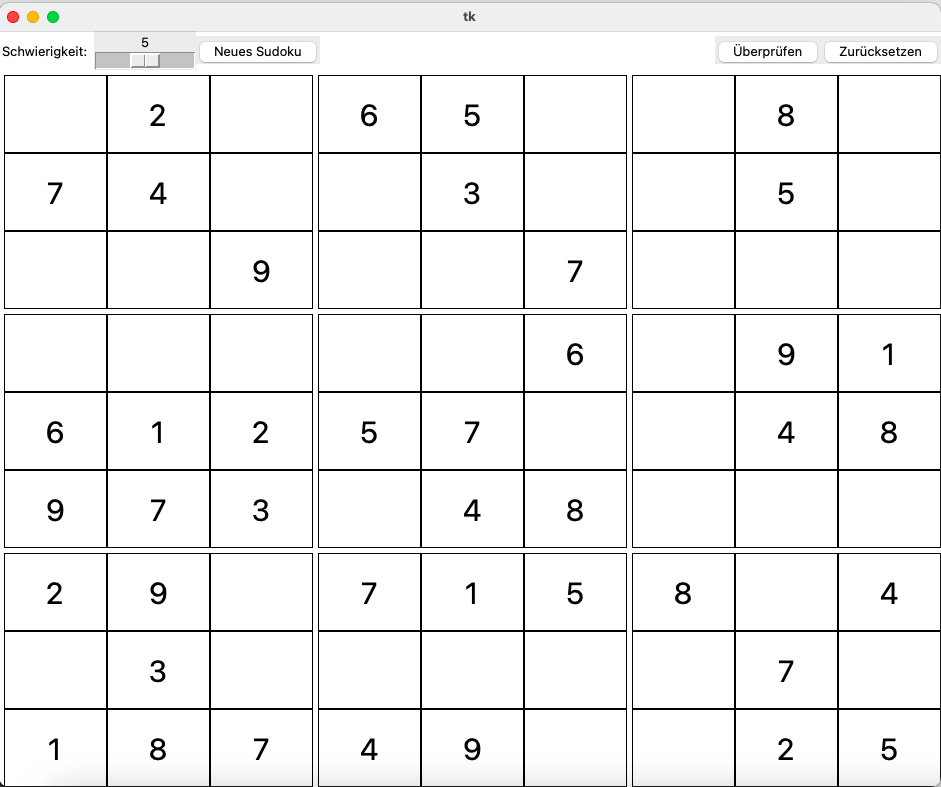

===================
Sudoku
===================
A simple Sudoku game.

The game is in german, feel free to add localization.

Starting the game
_____________________
The game is built in Python with Tkinter, meaning it is cross-platform. To open it on your platform, make
*play_sudoku.command* an executable python file for your system (or just execute `python main.py` on the command line).
On MacOS it is executable, so just double click the file.

Credits
_____________________
Inspired by https://github.com/MorvanZhou/sudoku 
Thanks for your work!
